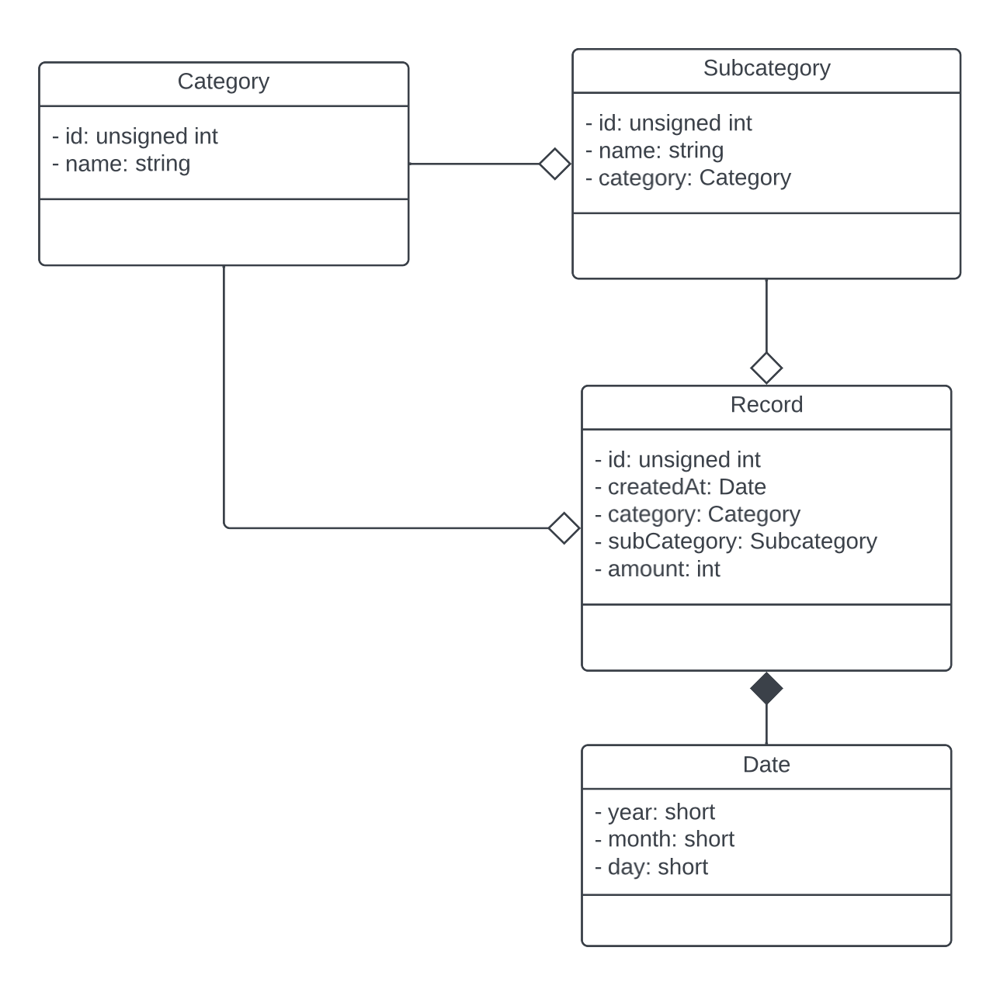

# BudgetWise

> This is the final project of the **_2023FA CSC-284-WB_** in BHCC. The requirements of this project are on [Google Docs](https://docs.google.com/document/d/1h_e2R88jX2n8EN1o4uLtIx0yrgCMuwTPUCg5vXB3qNA/edit).
This is a **private repository** on [GitHub](https://github.com/typinghare/advanced-cpp-bhcc/tree/main/src/final).

BudgetWise serves as an intuitive graphical tool designed for effective budget and expense tracking. Empowering users with the ability to effortlessly input both income and expenses, the platform offers seamless categorization and subcategorization features. Dive into insightful charts that provide a comprehensive overview of total income and expenses within specified categories or subcategories. For a more in-depth understanding of BudgetWise, explore the detailed [User Story](docs/user_story.md). Experience financial management with ease, precision, and visual clarity.

See the [Changelog](./docs/changelog.md) to find the specific timeline and updates of this project.

## TimeLine

This project is supposed to be accomplished before **Dec 12, 2023**, and the timeline is as follows:

| Time         | Checklist                                                    |
| ------------ | ------------------------------------------------------------ |
| Nov 19, 2023 | 1. Finish the entities. 2. Build `LoginWindow` and `SignUpWindow`. 3. Create utility functions. 4. Accomplish the timeline. |
| Nov 26, 2023 | 1. Create a server (backend). 2. Test the network connection between two ends. 3. Test the server receiving HTTP requests. |
| Dec 3, 2023  | 1. Implement all APIs on the backend. 2. Test sending HTTP requests from the frontend to the backend. |
| Dec 10, 2023 | 1. Implement all windows. 2. Implement graphical charts to display user data. |
| Dec 12, 2023 | 1. Test through user stories. 2. Supplement documentation. |

## UML Diagrams

> The UML diagrams are edited on [Lucid](https://lucid.app/lucidchart/902fa5b3-1783-4363-86a5-249380d1ddd5/edit).

The following is the UML diagram for the four main entities in this project. Each entity has a corresponding table in the server database. Note that in the MVC architecture, entities are also known as models.

## Development

Within this chapter, we will be covering crucial aspects of development, including style guides, utilities, and naming strategies. As this project is of a personal nature, consider this document as a personal aide, serving the purpose of aiding future recall and facilitating a comprehensive understanding of the elements created during subsequent follow-ups.

### Style Guides

Adherence to the [Google C++ Style Guide](https://google.github.io/styleguide/cppguide.html) is imperative for maintaining consistency and best practices throughout the entire codebase of this project.

#### Includes

All include should follow the order of `essential headers`, `builtin headers`, and `other headers`. The `essential headers` include the corresponding header file of a source file and the UI header file of a window class. The `builtin headers` include all headers that are not created by developers, such as Qt classes. There should be a blank line between different types of headers. The following is a typical example of a window class source file:

~~~c++
// LoginWindow.cpp

// Essential headers
#include "LoginWindow.h"
#include "ui_LoginWindow.h"

// Builtin headers
#include <QSharedPointer>

// Other headers
#include "windows.h"
#include "utils.h"
#include "constants.h"
#include "Database.h"
#include "LocalUser.h"
~~~

### Utilities

Ensure the incorporation of utility functions as necessary to align with best practices, thereby enhancing code readability. Utility files are placed under the `util` directory, which includes  `FileUtil`,  `WindowUtil` , `TimerUtil`, and so on.

#### FileUtil

Utilize the `FileUtil::open()` method to seamlessly handle file operations. This method not only verifies the file's existence but also performs the tasks of opening the file, invoking a specified callback function, and subsequently closing the file. Below are two illustrative examples demonstrating the application of this versatile method:

~~~c++
#include "utils.h"

// Create a QFile object
QFile file("path/to/the/file");

// Read the file
FileUtil::open(file, QIODevice::ReadOnly,  {
  // It's recommended using QTextStream() to read the file 
  QTextStream inStream(&file);
});

// Write the file
FileUtil::open(file, QIODevice::WriteOnly,  {
  // It's recommended using QTextStream() to write the file 
  QTextStream outStream(&file);
});

// You can also use these functions to achieve the same effect
FileUtil::read(file,  {
  // Do something
});
FileUtil::write(file,  {
  // Do something
});
~~~

#### WindowUtil

Utilize the `Window::jump()` method to seamlessly jump from one window to another:

~~~c++
#include "utils.h"

// Navigate to the main window in a Widget member method
// The current window will automatically close after the main window shows
WindowUtil::jump(this, new MainWindow);
~~~

#### TimerUtil
