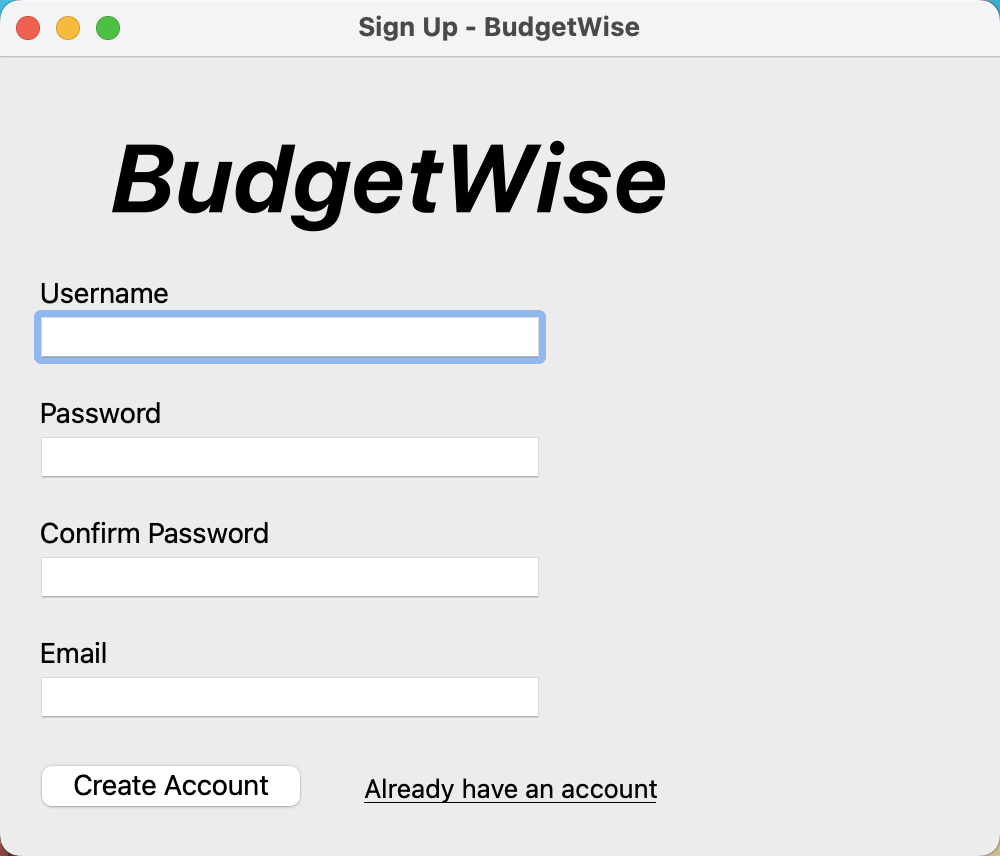
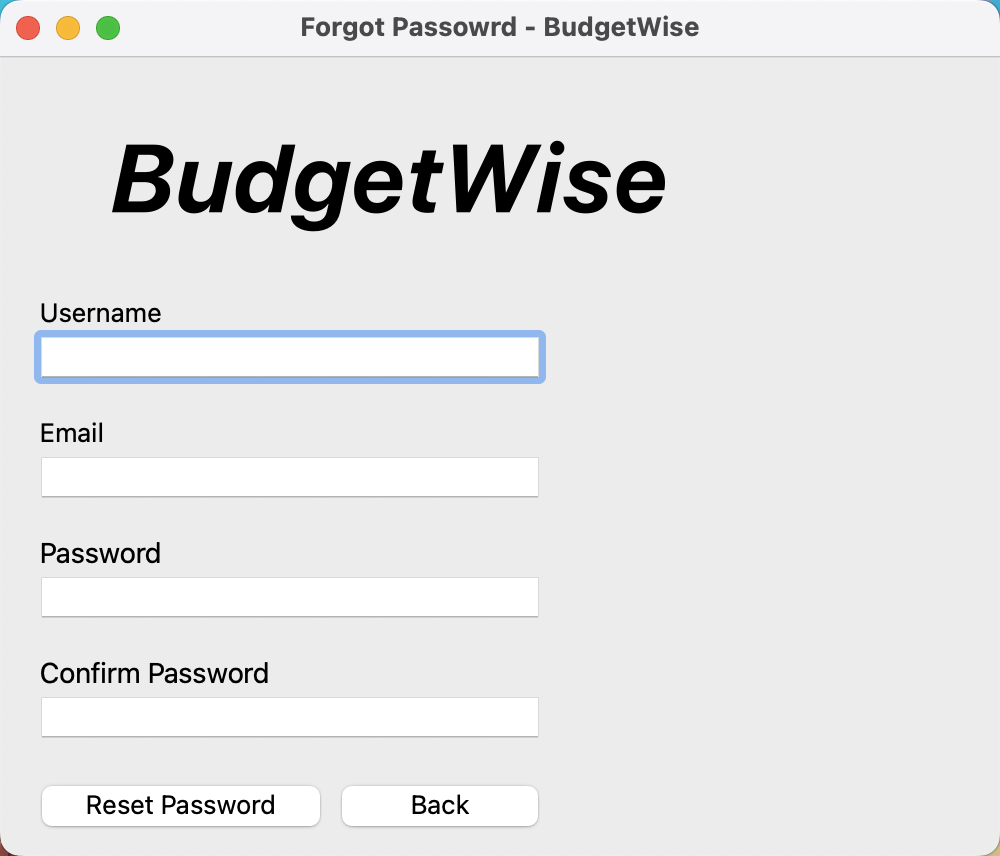
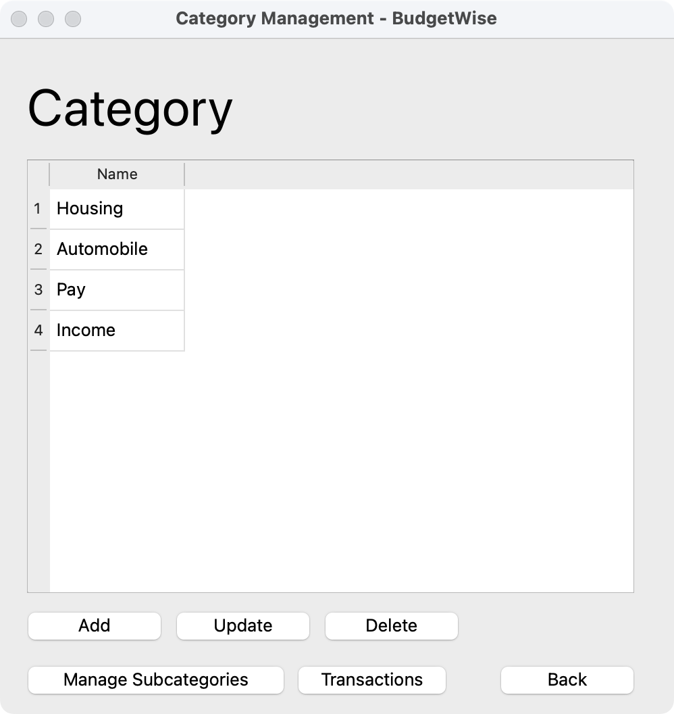
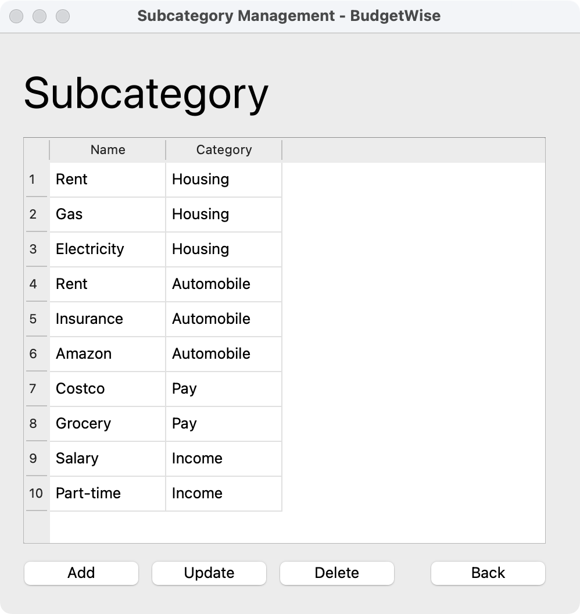
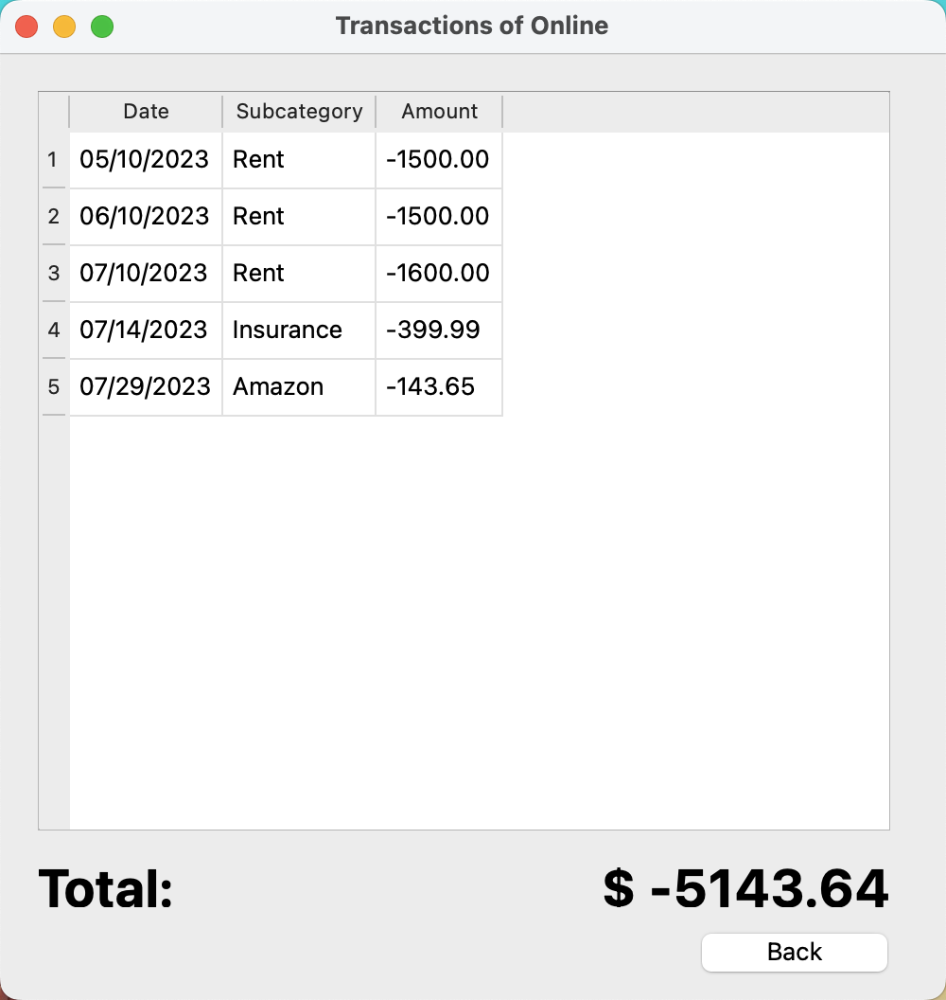
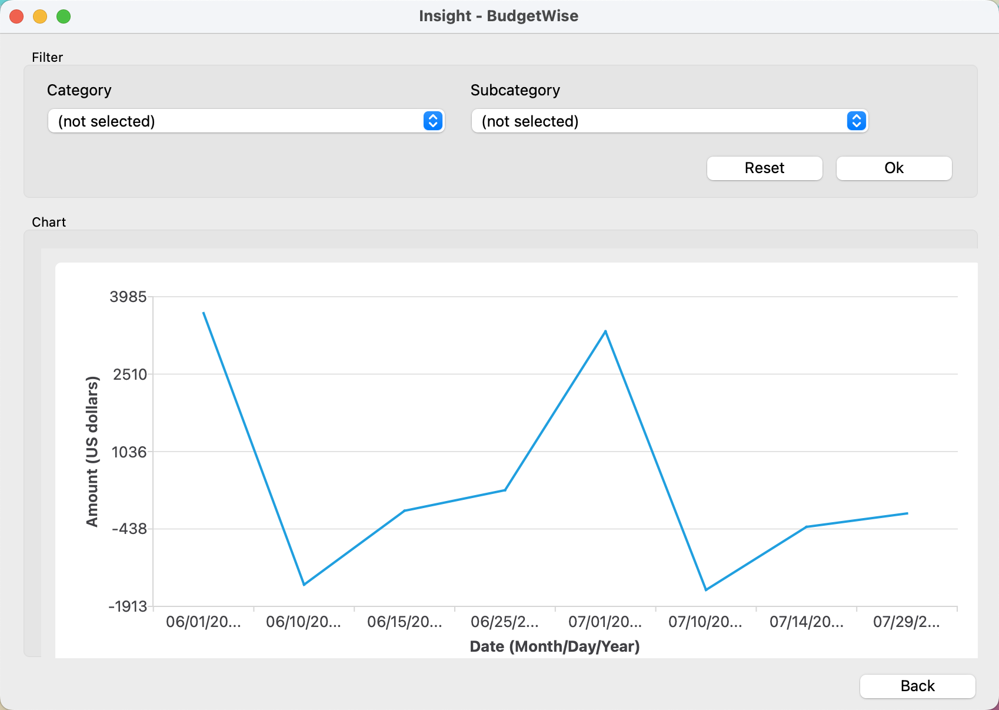

# BudgetWise Documentation

Meet BudgetWise – your new bestie for easy-peasy budgeting! We've spruced things up with a user-friendly vibe and cool features. Say hi to secure logouts, smooth category management, and snazzy interactive charts in the View Window. No more hassle – just effortless budget fun! 🚀💰

## Environment

To use this application, make sure you have installed `Sqlite 3.x.x` on your computer.

## User

### Sign Up

Users can sign up for a new account the first time they use BudgetWise. Click the `Sign UP` button to navigate to the sign-up window. The following is what you will have.

Create a username, password, and email to create an account. Note that you will not be able to create an account if the username already exists. In this situation, you must change another username. If you already have an account, press `Already have an account` button to return to the login window.

### Login

Users can log in to the system by entering their usernames and the corresponding passwords.

### Forgot Password

If users forget their password carelessly, they can reset the password of their account. Click the `Forgot Password` button to navigate to the forgot password. Users should input their username and the email address they used to create the account. Once the username and email match, users can reset their password. After resetting the password, the app will jump back to the login window with the username filled.

## Category and Subcategory

### Create/Update/Delete Categories

Click the `Manage Categories` button at the bottom of the main window to navigate to the category management window. By clicking the `add` window, a small pop-up window will show up, letting users enter a category name. Note that if the category name already exists, the creation will fail.

Users can select a category in the table, and click the `Update` button to change the name of it. Likewise, the updation will fail if the new category name already exists.

Users can also delete a category by selecting one in the table and clicking the `Delete` button. All subcategories and transactions associated with the category will be deleted altogether.

### Create/Update/Delete Subcategories

Click the `Manage Subcategories` button at the bottom of the main window to navigate to the subcategory management window. By clicking the `add` window, a small pop-up window will show up, letting users choose a category and enter a subcategory name. Note that if the subcategory name already exists in the category list, the creation will fail.

Users can also go to the category management window and double-click on a specific category to navigate to the subcategory management window. In this case, only the subcategories that are associated with the category will be displayed in the table.

Users can select a subcategory in the table, and click the `Update` button to change the category or the name of it. Likewise, the updation will fail if the new subcategory name already exists in the specific category list.

Users can also delete a subcategory by selecting one in the table and clicking the `Delete` button. All transactions associated with the subcategory will be deleted altogether.

## Transactions

### Add a Transaction

Click the `Add` button in the main window to add a transaction. Users should select a category, and optionally select a subcategory. The `(not selected)` option means there will be no subcategory associated with the transaction. After entering the amount, which should be a whole number of a decimal number, users will create a transaction successfully.

### Delete Last Transaction

Users can delete the last transaction by clicking the  `Delete Last` button.

### Check Transactions of a Specific Category 

Users can go to the category management window and select a category, then click the `Transactions` button at the bottom. Users will then be navigated to a transaction window, where all transactions associated with the category are displayed, and the total amount is down at the bottom. The following exhibits an example of a transaction list.

## Insight

Users can navigate to the insight window by clicking the `Insight` button in the main window. A chart will be drawn when users click the `OK` button. The y-axis is the amount of each transaction, and the x-axis is the date of each transaction. Moreover, users can select a  category or subcategory on the filter box, to draw a chart of transactions associated with a specific category or subcategory. Clicking the `reset` button will clear the category and subcategory.

